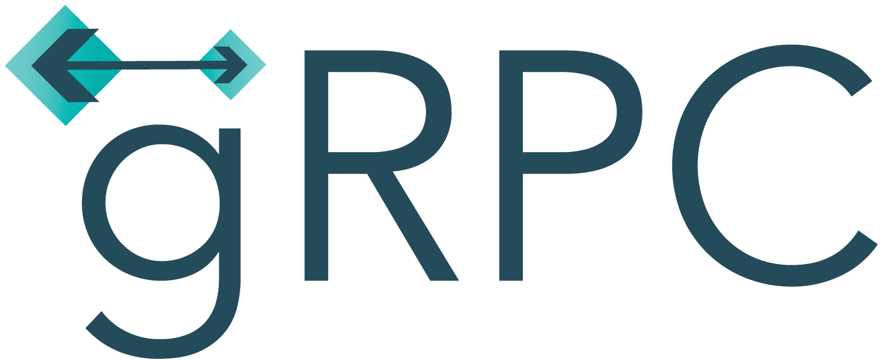

---
# You can also start simply with 'default'
theme: dracula
# some information about your slides (markdown enabled)
title: gRPC + Node.js
# apply unocss classes to the current slide
class: text-center
# https://sli.dev/features/drawing
drawings:
  persist: false
# slide transition: https://sli.dev/guide/animations.html#slide-transitions
transition: slide-left
# enable MDC Syntax: https://sli.dev/features/mdc
mdc: true
---

<h1>
   + 
</h1>

Montevideo JavaScript Meetup - Setiembre 2024

Joaquín Gatica

<div class="pt-12">
  <span @click="$slidev.nav.next" class="px-2 py-1 rounded cursor-pointer" hover="bg-white bg-opacity-10">
    <carbon:arrow-right class="inline"/>
  </span>
</div>

---
layout: statement
---

Es decir,

### **¿Vale la pena gRPC en Node.js?**

---
layout: image-right
image: ./images/author.jpg
---

# ¿Quién soy?

**Joaquín Gatica**

- CTO y Co-Founder en [AnagramDev](https://www.anagram.dev)
- Technical Architect

<br />

<logos-github-icon /> [https://github.com/joaquingatica](https://github.com/joaquingatica)

<br/>

<logos-linkedin-icon /> [https://linkedin.com/in/joaquingatica](https://linkedin.com/in/joaquingatica)

---
layout: two-cols
class: text-center
---

<br />

<br />
<br />
<br />

<br/>
Protobuf

::right::

<br />
<br />

<br />
<br />
<br />
<br />
<br />


---
layout: two-cols
---

# ¿Que es gRPC?

> Acrónimo recursivo: `gRPC Remote Procedure Calls`

<br />

<v-click>

- Framework de ejecución de procedimientos\
  remotos
- Multi-plataforma y multi-lenguaje
- Alta performance
- Usa HTTP/2 como protocolo de transporte
- Usa Protocol Buffers (Protobuf) para definición\
  de schema y encoding/decoding
- Autenticación mediante TLS y tokens en\
  metadata

</v-click>

::right::

<br />

<v-click>
Ejemplo de Protobuf gRPC schema:

```protobuf
syntax = "proto3";

package sample.people.v1;

import "google/protobuf/timestamp.proto";

service PeopleService {
  rpc GetPerson(GetPersonRequest) returns (GetPersonResponse) {
    option idempotency_level = NO_SIDE_EFFECTS;
  }
}
message GetPersonRequest {
  string id = 1;
}
message GetPersonResponse {
  Person person = 1;
}
message Person {
  string id = 1;
  repeated string names = 2;
  optional int32 age = 3;
  google.protobuf.Timestamp created_at = 4;
}
```

</v-click>

---
layout: intro
---

## ¿Vale la pena gRPC en Node.js?

Definamos "vale la pena" cómo **ser similar o mejor a las alternativas** como JSON + GraphQL o REST.

<br />

<v-click>

### ¿Por qué nos cuestionamos?

- Node.js **es second-class citizen** para Protobuf y gRPC
  - A diferencia de JSON + GraphQL o REST
  - Baja prioridad en la documentación oficial
- TypeScript tiene **aún menos relevancia** para gRPC
  - Muy poca mención en a la documentación oficial
- Node.js **no es un high-performance runtime**
  - Para encoding/decoding al menos
  - A diferencia de C++, Rust o Go

</v-click>

---

# Contexto

Para un cliente existente, nos pidieron crear un servicio nuevo para notificaciones de marketing.

<v-click>

- Exclusivamente Machine-to-Machine
- No crítico para negocio, pero usado desde otros servicios críticos
- Alta demanda de requests
- Bajo riesgo

</v-click>

<br />
<br />

<v-click><strong>Buena oportunidad para explorar gRPC, evaluando:</strong></v-click>

<br />

<v-click>- Performance </v-click><v-click><twemoji-check-mark-button /></v-click>

<br />

<v-click>- Seguridad / Autenticación </v-click><v-click><twemoji-check-mark-button /></v-click>

<br />

<v-click>- Developer Experience </v-click><v-click><twemoji-white-question-mark /></v-click>

---
layout: two-cols
---

## Developer Experience

- Promises - `async`/`await`
- Tipos primitivos en lugar de clases
- End-to-end type safety
- Curva de aprendizaje aceptable
- Ecosistema de librerías

<br />

<v-click at="3">

### Server

- Schema-first con codegen o code-first
- Schema linting y check de mejores prácticas

</v-click>

<br />

<v-click at="4">

### Clients

- Schema fetching + codegen
- GUIs para interactuar con el servicio

</v-click>

::right::

<div v-click="1">

```ts {2,7-11}
const getPerson = (call: Call): void => {
  const id = call.request.getId();
  peopleData.get(id).then((person) => {
    if (!person) {
      return callback(new Error(`Person not found for id ${id}`), null);
    }
    const response = new messages.GetPersonResponse();
    response.setName(person.name);
    response.setAge(person.age);
    response.setCreatedAt(person.createdAt);
    callback(null, response);
  });
};
```

</div>
<div v-click="2">
vs

```ts {2-4,9}
const service = {
  getPerson: async ({
    id,
  }: GetPersonRequest): Promise<DeepPartial<GetPersonResponse>> => {
    const person = await peopleData.get(id);
    if (!person) {
      throw new ServerError(Status.NOT_FOUND, `Person not found for id ${id}`);
    }
    return { ...person };
  },
};
```

</div>

---
layout: two-cols
---

# Schema + Codegen

<br />

<v-click>

## `ts-proto`

<br />

- Utilidad para codegen de TypeScript desde Protobuf schema
- Configurable para distintos estilos

</v-click>

<br />

<v-click>

## `@bufbuild/buf`

<br />

- Toolchain para Protobuf schemas
- CLI para codegen con `ts-proto`
- Linter

</v-click>

::right::

<br />
<br />
<br />

<v-click>

<div class="text-center">
  
</div>

<br />

```yaml
version: v1
plugins:
  - name: ts
    out: ./src/proto
    strategy: all
    path: ../node_modules/ts-proto/protoc-gen-ts_proto
    opt:
      - outputServices=nice-grpc
      - outputServices=generic-definitions
      - useExactTypes=false
      - esModuleInterop=true
```

</v-click>

<br />

<v-click>

```shell
$ buf generate ./proto # generate TypeScript source
$ buf build ./proto # build descriptor_set for reflection
$ buf lint ./proto # lint/check the protobuf schema
```

</v-click>

---
layout: two-cols
---

# gRPC Server & Client

<br />

### `nice-grpc`

> A gRPC library that is nice to you.

<br />

- Librería para gRPC server y clients
- Basada en `@grpc/grpc-js`
- Escrita en TypeScript y para TypeScript
- API para middlewares y ecosistema existente
- Expone servicios para usar con `ts-proto`

::right::

<br />
<br />
<br />

<v-click>

#### Middlewares

- `server-terminator` para cancelación de request en shutdown
- `client-deadline` para timeout de requests
- `client-retry` para reintentar procedimientos idempotentes

<br />

</v-click>
<v-click>

#### Librerías

- `server-health` para healthcheck
- `server-reflection` para permitir introspección
- `opentelemetry` para tracing usando OpenTelemetry

</v-click>

---
layout: image-right
image: ./images/grpcui-screenshot.png
---

# gRPC GUI

`gRPC UI`: interfaz web para interactuar con servicios gRPC

<br />

<logos-github-icon /> [fullstorydev/grpcui](https://github.com/fullstorydev/grpcui)

<br />
<br />

```shell
$ grpcui -plaintext localhost:50051
```

---
layout: intro
---

# Demo

<logos-github-icon /> https://github.com/joaquingatica/ts-grpc-demo

<br />
<br />

1. **Repositorio:** overview y ejecutar servidor & cliente
2. **gRPC UI:** data entry manual
3. **Server:** extender protobuf schema e implementar procedimiento
4. **Client:** introspección del schema y llamar a nuevo procedimiento

---
layout: intro
---

# Conclusión

gRPC en Node.js **vale la pena** si:

<v-click>- Tanto cliente como servidor son servicios </v-click><v-click><twemoji-check-mark-button /></v-click>

<br />

<v-click>- Se utilizan las librerías correctas </v-click><v-click><twemoji-check-mark-button /></v-click>

<br />

<v-click>- La curva de aprendizaje es aceptable </v-click><v-click><twemoji-check-mark-button /></v-click>

---
layout: intro
---

# Q&A

<div>

Repositorio: <logos-github-icon /> [joaquingatica/mvdjs-presentation-grpc](https://github.com/joaquingatica/mvdjs-presentation-grpc)

Presentación: <carbon-earth-filled /> [https://mvdjs-presentation-grpc.vercel.app](https://mvdjs-presentation-grpc.vercel.app)


</div>

---
layout: end
---

# ¡Muchas gracias!

<div>

<br />

<carbon-email /> [joaquin@gatica.dev](mailto:joaquin@gatica.dev)

<br/>

<logos-github-icon /> [https://github.com/joaquingatica](https://github.com/joaquingatica)

<br/>

<logos-linkedin-icon /> [https://linkedin.com/in/joaquingatica](https://linkedin.com/in/joaquingatica)

</div>
