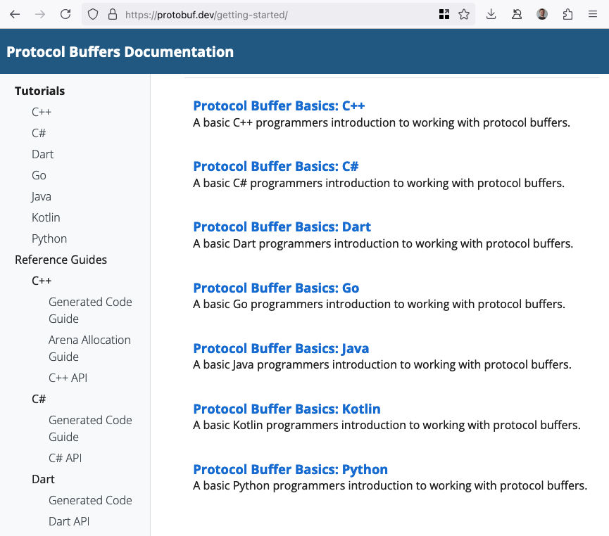

---
# You can also start simply with 'default'
theme: dracula
# some information about your slides (markdown enabled)
title: gRPC + Node.js
# apply unocss classes to the current slide
class: text-center
# https://sli.dev/features/drawing
drawings:
  persist: false
# slide transition: https://sli.dev/guide/animations.html#slide-transitions
transition: slide-left
# enable MDC Syntax: https://sli.dev/features/mdc
mdc: true
---

<h1>
   + 
</h1>

<v-click>

O mejor dicho,

### **¿Tiene sentido gRPC en Node.js?**

</v-click>

<br />

Montevideo JavaScript Meetup - Setiembre 2024

> Joaquín Gatica

<div class="pt-12">
  <span @click="$slidev.nav.next" class="px-2 py-1 rounded cursor-pointer" hover="bg-white bg-opacity-10">
    <carbon:arrow-right class="inline"/>
  </span>
</div>

---
layout: two-cols
---

# ¿Quién soy?

**Joaquín Gatica**

- CTO y Co-Founder en [AnagramDev](https://www.anagram.dev)
- Technical Architect

<br />

<logos-github-icon /> [https://github.com/joaquingatica](https://github.com/joaquingatica)

<br/>

<logos-linkedin-icon /> [https://linkedin.com/in/joaquingatica](https://linkedin.com/in/joaquingatica)

::right::

<div style="display: flex; justify-content: center; align-items: center; height: 100%;">
  
</div>

---
layout: cover
---

# Agenda

1. Introducción a Protobuf y gRPC
2. El Problema
3. Una Solución
4. Demo / Live Coding
5. Q&A

---
layout: two-cols
---

<div class="flex flex-col flex-justify-between flex-items-center pt-13 pb-10" style="height: 100%">
  
  <div class="text-center">
    
    <div style="height: 20px">Protocol Buffers</div>
  </div>
</div>

::right::

<div class="flex flex-col flex-justify-between flex-items-center pt-10 pb-10" style="height: 100%">
  
  
</div>

---
layout: intro
---

# 1. Introducción a<br />Protobuf y gRPC

---
layout: two-cols
---

# ¿Que es Protobuf?

> Protocol Buffers

<br />

<v-click>

- Formato de serialización de datos estructurados
- Multi-plataforma y multi-lenguaje
- Usa un Interface Definition Language (IDL)
- Serializa a un wire format hexadecimal
- Decodificación secuencial

</v-click>

::right::

<div class="text-center">
  
  <br/>
  Protocol Buffers

`sample/people/v1/person.proto`

</div>

```protobuf
syntax = "proto3";

package sample.people.v1;

import "google/protobuf/timestamp.proto";

message Person {
  string id = 1; // `string`
  repeated string names = 2; // `string[]`
  optional Status status = 3; // `Status?`
  int32 age = 4; // `number`
  google.protobuf.Timestamp created_at = 5; // `Date`
}

enum Status {
  STATUS_UNSPECIFIED = 0;
  STATUS_ALIVE = 1;
  STATUS_DEAD = 2;
}
```

---
layout: two-cols
---

## Ejemplo

<div class="pr-6">

Mensaje original:

```yaml
id: "71a71e3857976da7cc8dc7d23f480307"
names:
  - "Joaquín"
  - "Gatica"
status: "STATUS_ALIVE"
age: 34,
created_at:
  - seconds: 1726511388
  - nanos: 1726511388672
```

</div>

::right::

<v-click>

_JSON string_ codificado:

```
7B 0D 0A 20 20 22 69 64 22 3A 20 22 37 31 61 37
31 65 33 38 35 37 39 37 36 64 61 37 63 63 38 64
63 37 64 32 33 66 34 38 30 33 30 37 22 2C 0D 0A
20 20 22 6E 61 6D 65 73 22 3A 20 5B 22 4A 6F 61
71 75 ED 6E 22 2C 20 22 47 61 74 69 63 61 22 5D
2C 0D 0A 20 20 22 73 74 61 74 75 73 22 3A 20 22
53 54 41 54 55 53 5F 41 4C 49 56 45 22 2C 0D 0A
20 20 22 61 67 65 22 3A 20 33 34 2C 0D 0A 20 20
22 63 72 65 61 74 65 64 5F 61 74 22 3A 20 7B 0D
0A 20 20 20 20 22 73 65 63 6F 6E 64 73 22 3A 20
31 37 32 36 35 31 31 33 38 38 2C 0D 0A 20 20 20
20 22 6E 61 6E 6F 73 22 3A 20 31 37 32 36 35 31
31 33 38 38 36 37 32 0D 0A 20 20 7D 0D 0A 7D 00
```

</v-click>

<v-click>

_Protobuf wire format_ codificado:

```
0A 20 37 31 61 37 31 65 33 38 35 37 39 37 36 64
61 37 63 63 38 64 63 37 64 32 33 66 34 38 30 33
30 37 12 08 4A 6F 61 71 75 C3 AD 6E 12 06 47 61
74 69 63 61 18 01 20 22 2A 11 08 9C F2 A1 B7 06
10 80 B0 E4 E0 FF FF FF FF FF 01 00 00 00 00 00
```

</v-click>

---
layout: two-cols
---

# ¿Que es gRPC?

> Acrónimo recursivo: `gRPC Remote Procedure Calls`

<br />

<v-click>

- Framework de ejecución de procedimientos\
  remotos
- Multi-plataforma y multi-lenguaje
- HTTP/2 como protocolo de transporte
- Protobuf para encoding/decoding
- Autenticación mediante TLS y tokens en\
  metadata

<br />

</v-click>

<v-click>

#### HTTP/2 + Protobuf = 🚀 **Fast**

</v-click>

::right::

<div class="text-center">
  

`sample/people/v1/people_service.proto`

</div>

```protobuf
syntax = "proto3";

package sample.people.v1;

import "sample/people/v1/person.proto";

service PeopleService {
  rpc GetPerson(GetPersonRequest) returns (GetPersonResponse) {
    option idempotency_level = NO_SIDE_EFFECTS;
  }
}
message GetPersonRequest {
  string id = 1;
}
message GetPersonResponse {
  Person person = 1;
}
```

---
layout: intro
---

# 2. El Problema

---
layout: two-cols
---

<br />

### ¿Tiene sentido gRPC en Node.js?

JavaScript y TypeScript

- **ni aparecen en documentación** de Protobuf
- **escaso soporte oficial** para gRPC

Node.js

- **second-class citizen** para gRPC
- **no es un high-performance** runtime
- **no tiene low-level** types

<br />

<v-click>

### Pero...

> ...que Node.js no sea el entorno ideal no invalida las ventajas.

</v-click>

::right::

<br />

<div class="text-center pl-10">
  
</div>

<!--
- JavaScript **ni aparece** en documentación oficial de protobuf
- TypeScript **muy poca mención** en a la documentación oficial de gRPC
- Node.js **es second-class citizen** para Protobuf y gRPC
- Node.js **no es un high-performance runtime**
  - Para encoding/decoding al menos
  - A diferencia de C++, Rust o Go
- Se pierden ventajas de tipos de bajo nivel
  - `int32`, `uint64`, `fixed64` -> `number`
-->

---
layout: fact
---

<v-click>

## Entonces... ¿tiene sentido?

</v-click>

<v-click>

<br />

**Tiene sentido si resulta ser igual o mejor que las alternativas.**

</v-click>

<v-click>

(HTTP/1 + JSON + REST o GraphQL)

</v-click>

---

# Contexto

Para un cliente existente, nos pidieron crear un servicio nuevo para notificaciones de marketing.

<v-click>

- Exclusivamente Machine-to-Machine
- No crítico para negocio, pero usado desde otros servicios críticos
- Alta demanda de requests pero bajo riesgo
- No se anticipó frecuencia de cambios

</v-click>

<br />
<br />

<v-click><strong>Buena oportunidad para explorar gRPC.</strong></v-click>

<br />
<br />

<v-click>Criterios:</v-click>

<br />

<v-click>- Performance </v-click><v-click><twemoji-check-mark-button /></v-click>

<br />

<v-click>- Seguridad / Autenticación </v-click><v-click><twemoji-check-mark-button /></v-click>

<br />

<v-click>- Developer Experience </v-click><v-click><twemoji-white-question-mark /></v-click>

<br />

<v-click>- Mantenibilidad </v-click><v-click><twemoji-white-question-mark /></v-click>

---
layout: two-cols
---

## Criterios DX y Mantenibilidad

- End-to-end type safety
- Curva de aprendizaje aceptable
- Ecosistema de librerías
- Promises - `async`/`await`
- Tipos primitivos en lugar de clases

<br />

<v-click at="3">

### Server

- Schema-first con codegen o code-first
- Schema linting y check de mejores prácticas

</v-click>

<br />

<v-click at="4">

### Clients

- Schema fetching + codegen
- GUIs para interactuar con el servicio

</v-click>

::right::

<div v-click="1">

```ts {2,7-11}
const getPerson = (call: Call): void => {
  const id = call.request.getId();
  peopleData.get(id).then((person) => {
    if (!person) {
      return callback(new Error(`Person not found for id ${id}`), null);
    }
    const response = new messages.GetPersonResponse();
    response.setName(person.name);
    response.setAge(person.age);
    response.setCreatedAt(person.createdAt);
    callback(null, response);
  });
};
```

</div>
<div v-click="2">
vs

```ts {2-4,9}
const service = {
  getPerson: async ({
    id,
  }: GetPersonRequest): Promise<DeepPartial<GetPersonResponse>> => {
    const person = await peopleData.get(id);
    if (!person) {
      throw new ServerError(Status.NOT_FOUND, `Person not found for id ${id}`);
    }
    return { ...person };
  },
};
```

</div>

---
layout: intro
---

# 3. Una Solución

---
layout: two-cols
---

# Schema + Codegen

<br />

<v-click>

## `ts-proto`

<br />

- Utilidad para codegen de TypeScript desde Protobuf schema
- Configurable para distintos estilos

</v-click>

<br />

<v-click>

## `@bufbuild/buf`

<br />

- Toolchain para Protobuf schemas
- CLI para codegen con `ts-proto`
- Linter

</v-click>

::right::

<br />
<br />
<br />

<v-click>

<div class="text-center">
  
</div>

<br />

```yaml
version: v1
plugins:
  - name: ts
    out: ./src/proto
    strategy: all
    path: ../node_modules/ts-proto/protoc-gen-ts_proto
    opt:
      - outputServices=nice-grpc
      - outputServices=generic-definitions
      - useExactTypes=false
      - esModuleInterop=true
```

</v-click>

<br />

<v-click>

```shell
$ buf generate ./proto # generate TypeScript source
$ buf build ./proto # build descriptor_set for reflection
$ buf lint ./proto # lint/check the protobuf schema
```

</v-click>

---
layout: two-cols
---

# gRPC Server & Client

<br />

### `nice-grpc`

> A gRPC library that is nice to you.

<br />

- Librería para gRPC server y clients
- Basada en `@grpc/grpc-js`
- Escrita en TypeScript y para TypeScript
- API para middlewares y ecosistema existente
- Expone servicios para usar con `ts-proto`

::right::

<br />
<br />
<br />

<v-click>

#### Middlewares

- `server-terminator` para cancelación de request en shutdown
- `client-deadline` para timeout de requests
- `client-retry` para reintentar procedimientos idempotentes

<br />

</v-click>
<v-click>

#### Librerías

- `server-health` para healthcheck
- `server-reflection` para permitir introspección
- `opentelemetry` para tracing usando OpenTelemetry

</v-click>

---
layout: two-cols
---

# Reflection

`gRPCurl`: CLI para interactuar con servicios gRPC

```shell
$ grpcurl -plaintext -use-reflection localhost:50051 describe
```

<logos-github-icon /> [fullstorydev/grpcurl](https://github.com/fullstorydev/grpcurl)

<br />
<br />
<br />

# gRPC GUI

`gRPC UI`: interfaz web para interactuar con servicios gRPC

```shell
$ grpcui -plaintext localhost:50051
```

<logos-github-icon /> [fullstorydev/grpcui](https://github.com/fullstorydev/grpcui)

<br />
<br />

::right::

<div class="text-center">
  
</div>

---
layout: intro
---

# Demo / Live Coding

<logos-github-icon /> https://github.com/joaquingatica/ts-grpc-demo

<br />
<br />

1. **Repositorio:** overview y ejecutar servidor & cliente
2. **gRPC UI:** data entry manual
3. **Server:** extender protobuf schema e implementar procedimiento
4. **Client:** introspección del schema y llamar a nuevo procedimiento

---
layout: intro
---

# Conclusión

gRPC en Node.js **tiene sentido** si:

<v-click>- Tanto cliente como servidor son servicios backend </v-click><v-click><twemoji-check-mark-button /></v-click>

<br />

<v-click>- Se utilizan las librerías correctas </v-click><v-click><twemoji-check-mark-button /></v-click>

<br />

<v-click>- La curva de aprendizaje es aceptable para el equipo </v-click><v-click><twemoji-check-mark-button /></v-click>

---
layout: intro
---

# Q&A

<div>

Repositorio: <logos-github-icon /> [joaquingatica/mvdjs-presentation-grpc](https://github.com/joaquingatica/mvdjs-presentation-grpc)

Presentación: <carbon-earth-filled /> [https://mvdjs-presentation-grpc.vercel.app](https://mvdjs-presentation-grpc.vercel.app)


</div>

---
layout: end
---

# ¡Muchas gracias!

<div>

<br />

<carbon-email /> [joaquin@gatica.dev](mailto:joaquin@gatica.dev)

<br/>

<logos-github-icon /> [https://github.com/joaquingatica](https://github.com/joaquingatica)

<br/>

<logos-linkedin-icon /> [https://linkedin.com/in/joaquingatica](https://linkedin.com/in/joaquingatica)

</div>
